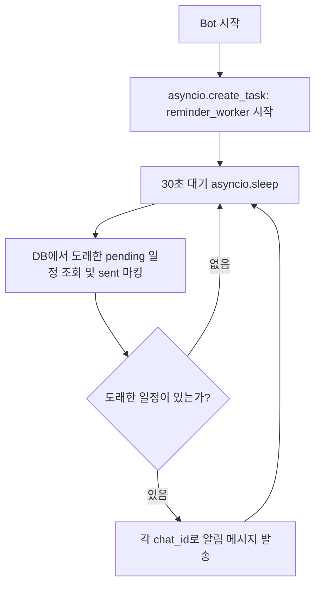

# 텔레그램 Notice Bot 일정 및 알림 기능 구현 계획서

본 문서는 `telegram_notice_bot`에 유연한 날짜/시간 입력 지원과 도래 시점 자동 알림 기능을 추가하기 위한 상세 구현 계획서입니다.  
프로젝트의 기존 원칙(**Simplicity First**, **Surgical Changes**, **안전한 격리**)을 준수합니다.

---

## 1. 요구사항 정의

1. **다양한 날짜 표기 지원**:
   - `YYYY-MM-DD`, `YYYY.MM.DD`, `YYYY/MM/DD` (예: `2026-09-20`, `2026.9.20`)
   - `MM/DD`, `MM.DD`, `MM-DD` (예: `9/20`, `09.20`)
   - `M월 D일`, `M월D일` (예: `9월 20일`, `9월20일`, `2026년 9월 20일`)
2. **연도 생략 허용**:
   - 연도 미입력 시 **현재 연도**를 기본 적용.
   - 단, 입력된 월/일이 현재 날짜보다 이미 지난 경우 **익년(다음 해)**으로 자동 보정.
     - 예: 현재가 9월 16일인데 `2/10` 입력 시 -> 2027년 2월 10일로 설정.
3. **시간 생략 허용 (시간 필수 아님)**:
   - 시간 미입력 시 기본 알림 시각은 **당일 오전 09:00:00 (KST)**.
   - 예외 처리: 오늘 날짜를 입력했으나 이미 오전 9시가 지난 경우:
     - 1안(권장): 사용자에게 시간 입력을 요청하거나 즉시 알림 대신 "당일 등록 시에는 현재 이후 시간을 지정해주세요" 안내.
     - 2안: 현재 시각으로부터 1시간 뒤 또는 당일 저녁(예: 18:00) 지정. (1안이 더 명확하고 오류가 적음)
4. **다양한 시간 표기 지원**:
   - `HH:MM` (예: `14:00`, `09:30`)
   - `H시`, `H시 M분`, `H시M분` (예: `14시`, `14시 30분`, `9시 10분`)
   - `오전/오후 H시(M분)` (예: `오후 2시`, `오후 2시 30분`, `오전 10시`)
5. **타임존 기준**:
   - 모든 날짜/시간 계산 및 DB 저장은 한국 표준시 **KST (`Asia/Seoul`, UTC+9)** 기준으로 처리.

---

## 2. 명령어 명세 (UX)

| 명령어 | 형식 및 예시 | 동작 설명 |
|---|---|---|
| **일정 등록** | `!일정 <날짜/시간> <내용...>`<br>• `!일정 9/20 회식`<br>• `!일정 9월20일 19:00 팀 회의`<br>• `!일정 2026.10.15 오후 3시 세미나` | 일정을 파싱하여 DB에 등록하고 등록 결과(날짜, 시각, ID)를 응답 |
| **일정 목록** | `!일정목록` (또는 `!일정` 단독 입력) | 현재 채팅방의 대기 중인(`pending`) 일정 목록을 시간순으로 표시 (ID 포함) |
| **일정 삭제** | `!일정삭제 <ID>`<br>예: `!일정삭제 4` | 해당 ID의 일정을 취소/삭제 |
| **자동 알림** | *(도래 시 자동 발송)*<br>`⏰ [일정 알림] 9월20일 회의 준비` | 지정 시각 도래 시 백그라운드 워커가 메시지를 발송하고 완료(`sent`) 처리 |

---

## 3. 유연한 날짜/시간 파서 설계

외부 대형 자연어 파싱 라이브러리(외부 의존성 및 Docker 이미지 무게 증가 방지) 대신, **Python 정규식(Regex)과 표준 `datetime`을 결합한 경량 파서(`date_parser.py`)**로 구현합니다.

### 3.1 파싱 정규식 패턴 구조
입력 문자열 앞부분에서 날짜와 시간 토큰을 추출하고, 나머지를 일정 내용(`content`)으로 분리합니다.

```
입력 예시: "!일정 9월20일 오후 2시 30분 프로젝트 중간 점검"
1단계: 날짜 패턴 매칭 -> (년도=None, 월=9, 일=20)
2단계: 시간 패턴 매칭 -> (시=14, 분=30)
3단계: 나머지 텍스트 -> "프로젝트 중간 점검"
```

#### 지원 패턴 정규식:
1. **날짜**:
   - `r"(?:(\d{4})[./년\s-]*)?(\d{1,2})[./월\s-](\d{1,2})일?"`
   - 매칭 지원:
     - `2026-09-20`, `2026.09.20`, `2026/09/20`, `2026년 9월 20일`
     - `9/20`, `09.20`, `9-20`, `9월 20일`, `9월20일`
2. **시간**:
   - `r"(?:(오전|오후)\s*)?(\d{1,2})(?::(\d{2})|시(?:\s*(\d{1,2})분?)?)"`
   - 매칭 지원:
     - `14:00`, `9:30`
     - `14시`, `14시 30분`, `14시30분`
     - `오후 2시`, `오후 2시 30분`, `오전 10시`
   - 시간이 없으면 기본값 `(hour=9, minute=0)` 부여.

### 3.2 연도 및 과거 시각 보정 로직
```python
now = datetime.now(ZoneInfo("Asia/Seoul"))
if year is None:
    year = now.year
    target_date = datetime(year, month, day, hour, minute, tzinfo=ZoneInfo("Asia/Seoul"))
    if target_date < now:
        target_date = target_date.replace(year=year + 1)
```

---

## 4. 데이터베이스 설계 ([storage.py](file:///C:/DEV/telegram_notice_bot/storage.py))

기존 `notices` 테이블과 독립적으로 `schedules` 테이블을 신설합니다.

### 4.1 스키마 (DDL)
```sql
CREATE TABLE IF NOT EXISTS schedules (
    id INTEGER PRIMARY KEY AUTOINCREMENT,
    chat_id INTEGER NOT NULL,
    remind_at TEXT NOT NULL,           -- ISO8601 KST 문자열 (예: '2026-09-20 14:00:00+09:00')
    content TEXT NOT NULL,
    status TEXT NOT NULL DEFAULT 'pending', -- 'pending', 'sent', 'canceled'
    created_at TEXT NOT NULL DEFAULT (datetime('now'))
);

CREATE INDEX IF NOT EXISTS idx_schedules_pending 
ON schedules (status, remind_at);
```

### 4.2 추가할 스토리지 메서드
- `add_schedule(chat_id: int, remind_at: str, content: str) -> int`: 새 일정 등록 후 발급된 `id` 반환.
- `list_upcoming_schedules(chat_id: int, limit: int = 20) -> list[sqlite3.Row]`: 해당 채팅방의 향후 대기 일정 목록 조회.
- `delete_schedule(chat_id: int, schedule_id: int) -> bool`: 해당 채팅방의 특정 일정 취소(삭제 또는 상태 `canceled`).
- `pop_due_schedules(now_iso: str) -> list[dict]`:
  - `status = 'pending' AND remind_at <= now_iso` 조건에 해당하는 일정들을 조회.
  - 동일 트랜잭션 내에서 `status = 'sent'`로 업데이트하여 중복 발송 방지.
  - 조회된 목록(`id`, `chat_id`, `content`, `remind_at`) 반환.

---

## 5. 백그라운드 알림 워커 설계 ([bot.py](file:///C:/DEV/telegram_notice_bot/bot.py))

외부 무거운 라이브러리(`APScheduler` 등) 없이 `asyncio` 백그라운드 루프로 구현합니다.

### 5.1 알림 루프 흐름


- **안정성 및 장애 복구**:
  - QNAP 또는 Docker 컨테이너가 재시작되어도 DB의 `pending` 상태와 `remind_at`을 기준으로 동작하므로, 다운타임 동안 도래했던 일정도 재부팅 직후 안전하게 일괄 발송됩니다.
  - 메시지 전송 실패(예: 봇이 강퇴당한 채팅방) 시 에러 로깅 후 다음 일정 처리를 방해하지 않도록 개별 try-except 처리.

---

## 6. 단계별 구현 및 검증 계획 (Goal-Driven Execution)

- [ ] **1단계: `date_parser.py` 작성 및 단위 테스트**
  - 다양한 날짜/시간 문자열(`9/20`, `9월20일`, `9.20 14:00`, `오후 3시`, 연도 생략 등) 파싱 테스트.
  - 과거 날짜의 익년 보정 검증.
- [ ] **2단계: `storage.py` 스키마 및 쿼리 메서드 확장**
  - `schedules` 테이블 생성 및 인덱스 추가.
  - `add_schedule`, `list_upcoming_schedules`, `delete_schedule`, `pop_due_schedules` 동기/비동기 래퍼 구현.
  - SQLite 격리 및 트랜잭션 정상 동작 검증.
- [ ] **3단계: `bot.py` 명령어 핸들러 추가**
  - `on_bang_message`에 `!일정`, `!일정목록`, `!일정삭제` 라우팅 추가.
  - 안내 문구 및 에러 메시지(날짜 형식 오류 시 사용법 예시 안내) 추가.
- [ ] **4단계: `bot.py` 백그라운드 알림 폴러 연동**
  - `Application.post_init` 또는 polling 시작 루프에서 백그라운드 태스크 실행.
  - 1분 뒤 알림 등록 후 자동 발송 검증.
- [ ] **5단계: 문서 및 배포 검증**
  - `README.md`의 명령어 표와 예시 갱신.
  - `AGENTS.md` 갱신.
  - `python -m py_compile bot.py storage.py date_parser.py` 컴파일 검증.

---

## 7. 디데이 & 기념일 (경과일) 기능 상세 설계 ⭐

사용자가 등록한 날짜를 기준으로 **미래 목표일까지 남은 일수(D-Day)**와 **과거 기념일로부터 경과된 일수(기념일/생후 일수)**를 자동 계산하여 제공합니다.

### 7.1 핵심 계산 규칙 (한국식 기념일 반영)

1. **미래 목표일 (카운트다운: 수능, 시험, 프로젝트 마감, 여행 등)**:
   - 조건: `target_date > today`
   - 공식: `diff = (target_date - today).days`
   - 표기: `D-{diff} ({diff}일 남음)`
   - 당일(`target_date == today`): `D-Day (오늘!)`

2. **과거 기념일 (경과일 카운트: 결혼기념일, 아기 생후 일수, 연애일 등)**:
   - 조건: `target_date <= today`
   - **사용자 필수 요구사항**: **당일을 0일이 아닌 '1일'로 계산**
   - 공식: `elapsed_days = (today - target_date).days + 1`
   - **검증 예시 (KST 기준)**:
     - 2026-09-16 당일 등록/조회: `(2026-09-16 - 2026-09-16).days + 1` = **1일째**
     - 2026-09-15 등록, 2026-09-16 조회: `(2026-09-16 - 2026-09-15).days + 1` = **2일째**
     - 2020-05-10 결혼, 2026-09-16 조회: `2320 + 1` = **2321일째 (D+2320)**
   - 표기: `{name}: {elapsed_days}일째 (D+{elapsed_days - 1}) [기준일: YYYY-MM-DD]`

### 7.2 명령어 명세 (UX)

| 명령어 | 형식 및 예시 | 동작 설명 |
|---|---|---|
| **디데이 등록** | `!디데이 <이름> <날짜>`<br>• `!디데이 수능 2026-11-19` (미래)<br>• `!디데이 결혼 2020-05-10` (과거)<br>• `!디데이 아기 2025.12.1` | 목표일 또는 기념일 등록 (동일 이름 시 갱신) |
| **디데이 전체 목록** | `!디데이` (단독 입력) | 현재 채팅방의 모든 디데이/기념일을 계산하여 목록 출력 |
| **디데이 개별 조회** | `!디데이 <이름>`<br>예: `!디데이 결혼` | 특정 디데이/기념일의 일수를 즉시 계산하여 단건 출력 |
| **디데이 삭제** | `!디데이삭제 <이름>`<br>예: `!디데이삭제 수능` | 해당 이름의 디데이 삭제 |

#### 출력 예시 (`!디데이` 입력 시):
```
📅 디데이 & 기념일 목록:
• 수능: D-64 (2026-11-19, 64일 남음)
• 프로젝트 오픈: D-Day (오늘!)
• 결혼: 2321일째 (D+2320, 2020-05-10 시작)
• 아기: 290일째 (D+289, 2025-12-01 시작)
```

### 7.3 데이터베이스 설계 (`ddays` 테이블)
기존 `storage.py`의 SQLite DB에 테이블을 추가합니다.

```sql
CREATE TABLE IF NOT EXISTS ddays (
    id INTEGER PRIMARY KEY AUTOINCREMENT,
    chat_id INTEGER NOT NULL,
    name TEXT NOT NULL,
    target_date TEXT NOT NULL,          -- 'YYYY-MM-DD'
    created_at TEXT NOT NULL DEFAULT (datetime('now')),
    UNIQUE(chat_id, name)
);

CREATE INDEX IF NOT EXISTS idx_ddays_chat 
ON ddays (chat_id, name);
```

### 7.4 기존 단축 조회(`!<키>`)와의 연계 (선택 구현)
- 사용자가 `!결혼` 또는 `!수능`처럼 공지 단축 키워드를 입력했을 때,
  1. `notices` 테이블에 해당 키가 있으면 공지 출력.
  2. 공지에 없고 `ddays` 테이블에 해당 이름이 있으면 디데이/기념일 계산 결과 자동 출력.
  -> 사용자가 별도로 `!디데이 결혼`을 치지 않고 `!결혼`만 쳐도 `결혼: 2321일째`를 바로 볼 수 있어 사용성이 대폭 향상됨.

---

## 8. 기타 향후 추가 고려 기능

1. **사전 리마인드 (N일 전 / N시간 전 예비 알림)**:
   - 당일 시작 전 미리 준비할 수 있도록 `!일정 9/20 14:00 회의 (1시간 전 알림)` 등 사전 알림 옵션.
2. **당일/이번 주 브리핑 (`!오늘`, `!이번주`)**:
   - `!오늘` 입력 시 오늘 예정된 일정과 오늘 도래한 기념일/디데이를 한눈에 요약 브리핑.
3. **정기 반복 일정 알림 (매주 / 매월)**:
   - `!반복 매주 화 19:00 팀 스터디`, `!반복 매월 25일 회비 납부`.
4. **공지 및 일정 통합 본문 검색 (`!검색 <키워드>`)**:
   - 본문에 특정 단어가 포함된 공지, 일정, 디데이를 검색.
5. **데이터 백업 및 내보내기 (`!백업`)**:
   - QNAP TS-251 운영 환경에서 `notices.db` 파일을 텔레그램 채팅으로 즉시 전송받는 관리자 기능.

